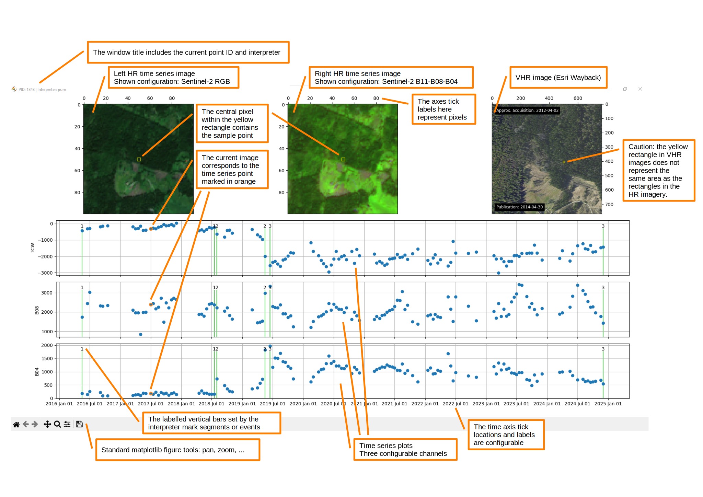

# Running `tsbrowser`

Once all the prerequisites are met, `tsbrowser` can be used to carry out the interpretation of time series. There are two operating modes depending on how the utility is called.

Run `tsbrowser --help` to get a list of supported arguments. In general, the tool has only one required argument: the configuration file.

## Manual selection of samples

You can call the tool with the option `--pid` and manually select point IDs for display, at least one. Points will be displayed on at a time in the order they have been selected.  

```
tsbrowser /path/to/tsbrowser_config.py --pid 1 2 3
```

The given IDs must be contained in the vector file specified in the given `tsbrowser` configuration file. In the example above, the sample IDs 1, 2, and 3 will be shown sequentially to the interpreter.

## Automatic orchestrator

Calling the tool without the `--pid` option enables the automatic orchestrator.

```
tsbrowser /path/to/tsbrowser_config.py
```

This mode compares which samples are in the sample vector file and which ones were already interpreted (i.e., have a flag file in the `flag_dir` specified in the config file). This mode then sequentially shows samples from the sample vector file which have not been interpreted yet.

## Interactive plot interface

Once the imagery is loaded, an interactive `matplotlib` figure opens. The figure elements are explained in the annotated image below. If the image appears too small, use right click &rarr; open image in new tab to view it larger. In the example, the interpreter has identified and marked three segments in the time series.



## Interactions using the mouse

The interactive figure allows you to quickly browse through the time series. Just left-click on any of the blue dots to display the corresponding image in the upper left and middle image sub-plots.
  
A right-click on any of the blue dots sets the default flag, i.e. a labelled, vertical green bar, on the corresponding observation. The label is the configured default label. If the corresponding observation is already flagged, the right-click removes the flag.

Use the mouse wheel to browse through the available VHR imagery shown in the upper right image sub-plot. 

You may also use the standard figure tools in the lower left part of the window - pan and zoom work in both time series and image plots. 

## Interactions using the keyboard

Keybord commands are enabled by using the Alt key as a modifier. Browsing through time is mapped to the arrow keys:

| Keyboard Shortcut | Action |
|-------------------|--------|
| Alt + → | Move one step forward in the HR time series |
| Alt + ← | Move one step backward in the HR time series |
| Alt + . | Move one year forward in the HR time series |
| Alt + , | Move one year backward in the HR time series |
| Alt + ↑ | Move one step forward in the VHR time series |
| Alt + ↓ | Move one step backward in the VHR time series |

You also need to use the keyboard in order to set any flags other than the default flag. 

| Keyboard Shortcut | Action |
|-------------------|--------|
| Alt + 0-9 | Set flag labelled 0-9 on the currently selected observation (marked by the orange circle) |
| Alt + letter | Define additional, non-numeric flags using the parameter `add_flag_labels` in the configuration file |

## Finishing the interpretation

Once you are finished with setting flags according to your specific interpretation nomenclature and guideline, you can close the figure window (although this is not required). Then move your attention to the console running the tool. 

Firstly, you are prompted to enter your subjective confidence regarding the interpretation (high, medium, or low). This is required to finish the interpretation of a sample properly. Secondly, you may enter an optional comment about the sample. Press enter again to confirm and the next plot will be displayed if there are any left in the queue.  

## Accessing the interpretation results

For each sample point, the interpretation result is stored in a separate JSON file. The JSON files can be found in the directory given by the configuration parameter `flag_dir`. An example is given below.

??? Example

    ```json title="Interpretation result JSON file"
    --8<-- "docs/flags_2.json"
    ```

As you can see, the flag timestamps and  corresponding labels are stored. Additionally you can find the interpreter confidence self-assessment, the comment string, and the interpreter ID in the file.
